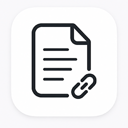
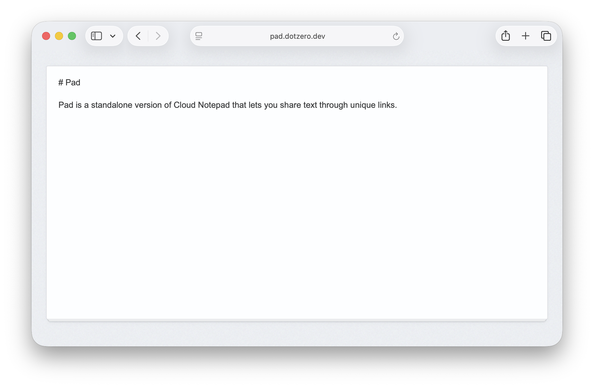

# Pad



A dead-simple shared text pad. Paste text, get a link, share it with anyone.

Unlike pastebin-like services, every shared page remains editable, making Pad feel more like a lightweight internet clipboard than a publishing platform. No accounts, no permissions, no formatting controls, and no unnecessary features.

## Features

* 🔗 Instant text sharing via unique URLs
* ✏️ Shared pages stay editable after creation
* 📝 Markdown preview and raw text views
* 🚪 No registration or login
* 🧘 Minimalist interface focused entirely on content
* 🌐 Works as a personal or shared internet clipboard



## Run with Docker

```bash
docker run -d --rm --name pad -p "8080:8080" ghcr.io/dotzero/pad:latest
```

## Run with Docker Compose

Create a `docker-compose.yml` file:

```yaml
services:
  pad:
    image: ghcr.io/dotzero/pad:latest
    restart: unless-stopped
    ports:
      - "8080:8080"
    environment:
      PAD_PORT: "8080"
      PAD_SECRET: random_salt_here
    volumes:
      - pad_db:/app/db

volumes:
  pad_db:
```

Run `docker compose up -d`, wait for the container to start, then open `http://localhost:8080`.

### Command line options

```bash
Usage:
  pad [OPTIONS]

Application Options:
      --host=        listening address (default: 0.0.0.0) [$PAD_HOST]
      --port=        listening port (default: 8080) [$PAD_PORT]
      --bolt-path=   BoltDB data directory (default: ./var) [$BOLT_PATH]
      --secret=      shared secret key used to generate IDs [$PAD_SECRET]
      --static-path= path to static assets (default: ./static) [$STATIC_PATH]
      --tpl-path=    path to template files (default: ./templates) [$TPL_PATH]
      --tpl-ext=     template file extension (default: .html) [$TPL_EXT]
      --verbose      enable verbose logging
  -v, --version      show version information

Help Options:
  -h, --help         Show this help message
```

## License

[MIT](https://opensource.org/license/mit)
